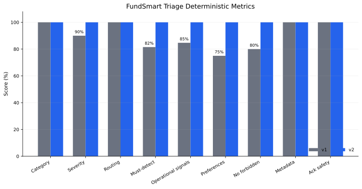
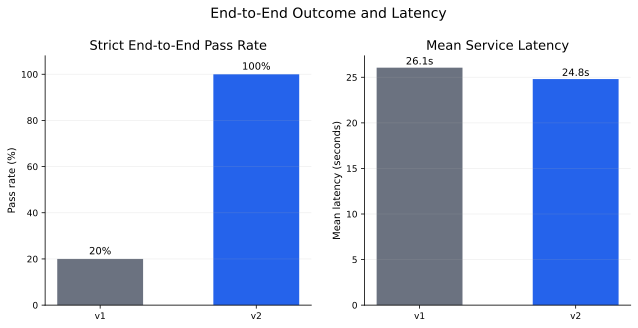
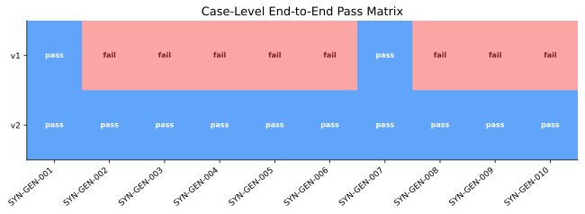
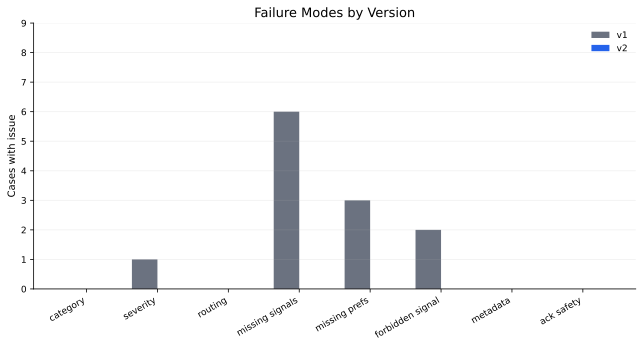
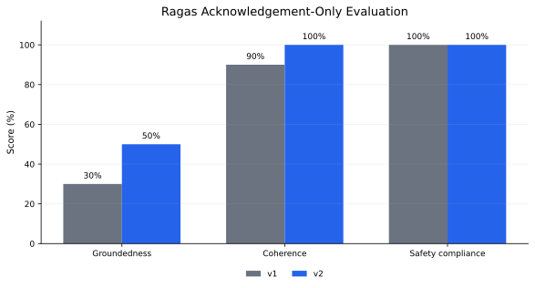

# FundSmart AI Complaint Triage System Report

## Content

- [0. Executive Summary](#0-executive-summary)
  - [0.1 Real Problem](#01-real-problem)
  - [0.2 Delivered Outcome](#02-delivered-outcome)
  - [0.3 Latest Evaluation Result](#03-latest-evaluation-result)
- [1. Problem Framing And Scope](#1-problem-framing-and-scope)
  - [1.1 What The System Is Solving](#11-what-the-system-is-solving)
  - [1.2 What Is Deliberately Out Of Scope](#12-what-is-deliberately-out-of-scope)
- [2. System Architecture](#2-system-architecture)
  - [2.1 Runtime Components](#21-runtime-components)
  - [2.2 Triage Service Flow](#22-triage-service-flow)
  - [2.3 Schema Design](#23-schema-design)
  - [2.4 Why The Service Is LLM-Only](#24-why-the-service-is-llm-only)
  - [2.5 Persistence And Review](#25-persistence-and-review)
- [3. Synthetic Data Generation](#3-synthetic-data-generation)
  - [3.1 Purpose](#31-purpose)
  - [3.2 Generation Flow](#32-generation-flow)
  - [3.3 Representativeness Strategy](#33-representativeness-strategy)
  - [3.4 Label Taxonomy](#34-label-taxonomy)
  - [3.5 Guardrails Against Bad Synthetic Data](#35-guardrails-against-bad-synthetic-data)
- [4. Evaluation Harness](#4-evaluation-harness)
  - [4.1 Black-Box Evaluation Method](#41-black-box-evaluation-method)
  - [4.2 Metrics](#42-metrics)
  - [4.3 End-To-End Pass Definition](#43-end-to-end-pass-definition)
  - [4.4 Ragas Acknowledgement Evaluation](#44-ragas-acknowledgement-evaluation)
- [5. Results And Iteration](#5-results-and-iteration)
  - [5.1 Deterministic Triage Results](#51-deterministic-triage-results)
  - [5.2 Case-Level Results](#52-case-level-results)
  - [5.3 Failure Mode Reduction](#53-failure-mode-reduction)
  - [5.4 Acknowledgement Quality Results](#54-acknowledgement-quality-results)
  - [5.5 What v1 Got Wrong](#55-what-v1-got-wrong)
  - [5.6 What Changed In v2](#56-what-changed-in-v2)
- [6. What This Proves And Does Not Prove](#6-what-this-proves-and-does-not-prove)
- [7. Productionization And Future Work](#7-productionization-and-future-work)

## 0. Executive Summary

This project implements a FundSmart complaint triage prototype for risk-sensitive financial complaints. The system receives a single complaint document, extracts operational and regulatory signals, classifies the matter, recommends routing and SLA handling, drafts a customer acknowledgement, validates that acknowledgement, stores the run, and supports a repeatable evaluation harness.

The main design decision was to treat complaint triage as a governed intake workflow rather than a free-form text generation task. The LLM is used where semantic understanding is needed, but its output is constrained by typed schemas, deterministic escalation guardrails, explicit acknowledgement validation, persistence, and black-box evaluation.

### 0.1 Real Problem

The real problem is not simply "classify complaint text." A financial services complaint intake system must reliably detect and route risk:

- Financial hardship or vulnerability.
- Responsible lending allegations.
- Collections conduct concerns.
- Fraud or identity theft.
- AFCA, legal, or regulator escalation risk.
- Self-harm or immediate safety risk.
- Customer communication preferences.
- Customer-facing acknowledgement safety.

The downstream users are human complaint, hardship, collections, and compliance teams. They need structured fields that can drive queues, SLAs, review, audit, and safe customer contact.

### 0.2 Delivered Outcome

The repository contains:

- `services/triage_service`: a standalone FastAPI triage service using an LLM structured-output pipeline.
- `services/sythetic_data_generation`: a FastAPI service for batch synthetic complaint benchmark generation.
- `sythetic_tests/`: generated complaint inputs, gold labels, and generation notes.
- `evaluation/triage_service_evaluation.ipynb`: a Papermill-driven evaluation notebook that calls the running triage service.
- `scripts/run_triage_service_evaluation.sh`: repeatable evaluation runner with timestamped outputs.
- `figures/`: matplotlib SVG charts generated from the latest evaluation run.

### 0.3 Latest Evaluation Result

The latest valid evaluation run is:

```text
evaluation/results/triage_service/papermill_runs/20260614_140520/
```

It evaluated 10 synthetic complaint cases across two pipeline versions:

- `v1`: baseline prompt and schema behavior.
- `v2`: stronger schema use, explicit signal extraction, deterministic calibration, routing guardrails, acknowledgement judging, and fallback acknowledgement revision.

Headline deterministic results:

| Metric | v1 | v2 | Change |
|---|---:|---:|---:|
| Category accuracy | 100.0% | 100.0% | 0.0% |
| Severity accuracy | 90.0% | 100.0% | +10.0% |
| Routing accuracy | 100.0% | 100.0% | 0.0% |
| Must-detect recall | 81.5% | 100.0% | +18.5% |
| Operational signal recall | 84.7% | 100.0% | +15.3% |
| Preference recall | 75.0% | 100.0% | +25.0% |
| No forbidden-signal rate | 80.0% | 100.0% | +20.0% |
| Metadata accuracy | 100.0% | 100.0% | 0.0% |
| Deterministic acknowledgement safety | 100.0% | 100.0% | 0.0% |
| Strict end-to-end pass rate | 20.0% | 100.0% | +80.0% |
| Mean latency | 26.059s | 24.805s | -1.254s |

The deterministic triage benchmark shows v2 as a clear improvement over v1. Ragas acknowledgement-only results also improved on groundedness and coherence while preserving safety compliance. That distinction is important: triage correctness and acknowledgement quality are measured separately, but both improved in the current report-facing result set.

## 1. Problem Framing And Scope

### 1.1 What The System Is Solving

The system solves first-pass complaint intake for FundSmart-style financial services complaints. It does not make final complaint decisions. It prepares a structured intake packet so a human team can act faster and more consistently.

Input:

```text
Complaint document containing visible metadata and body text.
```

Example input shape:

````markdown
**Channel:** Email
**Received:** 2026-04-14 10:32 AEST
**Customer ID:** CUST-48291
**Subject:** Wrong information from your staff caused a missed payment

```
Customer complaint body...
```
````

Output:

- Category.
- Severity.
- Detected operational signals.
- Vulnerability signals.
- Regulatory flags.
- Recommended routing.
- SLA recommendation.
- Customer preferences.
- Extracted metadata.
- Complaint summary.
- Reasoning.
- Acknowledgement draft.
- Acknowledgement validation state.

The key engineering point is that the output is a contract, not just a response. The fields can be evaluated deterministically and consumed downstream.

Example triage result:


### 1.2 What Is Deliberately Out Of Scope

The prototype does not solve:

- Full case management.
- Final complaint adjudication.
- Refund or waiver decisions.
- Credit-file correction decisions.
- RAG over policy documents.
- Reranking.
- Historical customer account lookup.
- Human workforce scheduling.
- Production authentication and authorization.

Those were left out deliberately. The candidate brief asks for a working prototype and evaluation harness. The highest-value slice is therefore the complaint intake decision: one complaint document in, structured triage and safe acknowledgement out.

## 2. System Architecture

### 2.1 Runtime Components

The project has two service-level components and one evaluation harness.

| Component | Path | Purpose |
|---|---|---|
| Triage service | `services/triage_service` | Performs LLM-based complaint triage, acknowledgement drafting, acknowledgement validation, deterministic calibration, persistence, and review storage. |
| Synthetic data generation service | `services/sythetic_data_generation` | Generates benchmark complaint cases and gold labels in batch using fixed seed examples and a generation spec. |
| Evaluation harness | `evaluation/triage_service_evaluation.ipynb` and `scripts/run_triage_service_evaluation.sh` | Calls the running triage service for v1 and v2, scores outputs, writes timestamped artifacts, and generates interpretation tables. |

### 2.2 Triage Service Flow

The triage service is implemented as a LangGraph workflow behind FastAPI.

```text
POST /triage?version=v1|v2
        |
        v
normalise_complaint
        |
        v
triage_complaint
        |
        v
calibrate_triage_output
        |
        v
risk_safety_check
        |
        +-------------------------------+
        |                               |
        v                               v
set_urgent_escalation_routing     set_standard_routing
        |                               |
        +---------------+---------------+
                        |
                        v
validate_acknowledgement
        |
        +-------------------------------+
        |                               |
        v                               v
revise_acknowledgement             save_output
        |                               |
        +---------------<---------------+
                        |
                        v
                    response
```

The core sequence is:

1. `normalise_complaint`: validates the incoming request into a Pydantic input model.
2. `triage_complaint`: sends only `complaint_document` to the LLM structured-output pipeline.
3. `calibrate_triage_output`: applies deterministic v2 calibration where the business rule is clear.
4. `risk_safety_check`: detects critical escalation conditions from structured output.
5. `set_urgent_escalation_routing` or `set_standard_routing`: forces routing where the policy is unambiguous.
6. `validate_acknowledgement`: uses an LLM judge plus hard checks for acknowledgement quality.
7. `revise_acknowledgement`: falls back to a conservative acknowledgement if validation fails.
8. `save_output`: returns and persists the final structured output.

### 2.3 Schema Design

The schema is intentionally operational. It separates what the system knows, what it suspects, where it should route, and what the customer-facing acknowledgement says.

Core category enum:

| Category | Meaning |
|---|---|
| `service_error` | Operational service issue, app failure, incorrect staff information, document upload issue, or process failure. |
| `financial_hardship` | Customer indicates they cannot meet repayments or requests repayment support. |
| `responsible_lending` | Customer alleges the original lending decision was unaffordable or incorrectly assessed. |
| `collections` | Collections contact, payment arrangement, overdue contact, or collections conduct issue. |
| `fees_charges` | Dispute mainly about fees, charges, late fees, duplicate charges, or refunds. |
| `fraud_or_identity` | Unauthorized loan, identity theft, impersonation, or unrecognized account. |
| `unclear_or_other` | Wrong-company complaints, minimal unclear complaints, or unsupported complaint types. |

Core output fields:

| Field | Why It Exists |
|---|---|
| `category` | Drives complaint type and primary handling path. |
| `severity` | Drives urgency and SLA. |
| `detected_signals` | Holds operational facts such as duplicate payment, app crash, payment not recognized, workplace contact, or credit-file concern. |
| `vulnerability_signals` | Holds customer vulnerability indicators such as self-harm, job loss, reduced income, dependent children, distress, or language access needs. |
| `regulatory_flags` | Holds compliance risks such as responsible lending, AFCA, privacy, credit reporting, fraud, or collections conduct. |
| `recommended_routing` | Maps the matter to the correct internal team. |
| `sla_recommendation` | Indicates standard, same-day, or urgent review. |
| `customer_preferences` | Captures contact preferences and requested constraints. |
| `extracted_metadata` | Captures visible channel, received time, customer ID, subject, thread context, agent, duration, and note. |
| `acknowledgement_draft` | Customer-facing acknowledgement subject to safety validation. |

The most important schema refinement was `detected_signals`. Without it, operational facts had to be forced into vulnerability or regulatory fields. That made evaluation noisy and made downstream consumption less reliable.

### 2.4 Why The Service Is LLM-Only

The service uses an LLM because the complaint content is ambiguous, messy, and semantically loaded:

- Short complaints can imply collections or payment disputes with little context.
- Hardship can be hidden inside a fee complaint.
- Responsible lending can appear alongside hardship, late fees, collections, and financial counsellor involvement.
- Self-harm can be expressed indirectly.
- Customers may write in informal, sarcastic, ESL-style, or call-transcript language.

There is no heuristic fallback path in the final service. The LLM is always used for semantic extraction and classification. Deterministic code is used after the LLM for policy calibration, normalization, and safety guardrails, not as an alternative classifier.

### 2.5 Persistence And Review

The service includes PostgreSQL persistence and review endpoints:

- `POST /triage`: stores each triage run and returns a `run_id`.
- `GET /triage-runs`: lists recent runs.
- `GET /triage-runs/{run_id}`: retrieves a run.
- `POST /triage-runs/{run_id}/review`: stores human review feedback.

This matters because a triage system needs auditability. The prototype can record:

- The original complaint document.
- The version used.
- The model output.
- The final calibrated output.
- The acknowledgement validation status.
- Human review overrides.

Database schema evolution is managed with Alembic so persisted triage and review records can evolve without ad hoc table changes.

## 3. Synthetic Data Generation

### 3.1 Purpose

The project includes synthetic data generation because the brief asks for a harness and additional test cases, but no production complaint dataset is available.

The goal is not to pretend synthetic data estimates real-world production performance. The goal is narrower and more defensible:

```text
Can the downstream triage system handle a deliberate coverage set of realistic, risk-sensitive complaint patterns?
```

This turns synthetic data into a regression and failure-mode harness.

### 3.2 Generation Flow

The generation service is also LLM-based and uses fixed seed examples as a style and label reference.

```text
POST /generate
        |
        v
validate generation request
        |
        v
load fixed reference cases
        |
        v
build structured generation messages
        |
        v
LLM structured output
        |
        v
validate SyntheticBatchOutput
        |
        v
normalize IDs and source fields
        |
        v
return combined JSONL, split complaint JSONL, split gold-label JSONL, and notes
```

Fixed reference cases are kept as a small, versioned knowledge base for generation style and label shape. Generated outputs are split into complaint inputs, gold labels, combined JSONL cases, and generation notes.

### 3.3 Representativeness Strategy

The synthetic dataset is designed to be risk- and failure-mode representative, not statistically representative.

That distinction is important:

- Statistical representativeness would require real complaint volume, channel distribution, category distribution, customer segment distribution, and historical labels.
- This prototype does not have that data.
- Instead, the dataset deliberately covers the failure modes that would be dangerous or embarrassing if missed.

Coverage dimensions:

| Dimension | What It Tests |
|---|---|
| Channel realism | Email, SMS, in-app message, app feedback, call transcript, and auto-transcribed calls. |
| Metadata extraction | Channel, received time, customer ID, subject, thread context, agent, duration, and notes. |
| Complaint category coverage | Service error, hardship, responsible lending, collections, fees/charges, fraud/identity, unclear/wrong-company. |
| Risk coverage | Self-harm, fraud, responsible lending, collections conduct, credit file concern, privacy, hardship, vulnerable customer signals. |
| Language variation | Short complaint, angry complaint, sarcastic complaint, ESL-style writing, ambiguous complaint, multi-issue complaint. |
| Downstream actionability | Required signals, forbidden signals, preferences, routing, severity, and acknowledgement checks. |

The most important design point is that generation is aligned to the downstream contract. Each synthetic case is not just text. It contains gold labels for the exact fields the service is expected to produce.

### 3.4 Label Taxonomy

The benchmark separates scenario shape from operational triage facts.

| Label Field | Purpose |
|---|---|
| `scenario_tags` | Describes the kind of test case, such as `sarcasm`, `routine_app_bug`, or `hidden_hardship_in_fee_complaint`. |
| `expected_signals` | Operational facts the triage service should extract, such as `payment_dispute`, `credit_file_concern`, or `collections_contact`. |
| `expected_preferences` | Contact and handling preferences the service should extract. |
| `forbidden_signals` | Things the service must not incorrectly detect, such as fraud in a routine app issue. |
| `expected_category` | Gold complaint category. |
| `expected_severity` | Gold severity. |
| `expected_routing` | Gold routing. |

This split avoids a common evaluation mistake. A model should not fail an operational triage benchmark because it did not output a scenario-shape label such as `sarcasm`, unless sarcasm is explicitly part of the downstream schema.

### 3.5 Guardrails Against Bad Synthetic Data

Synthetic data can easily become self-referential or unrealistic. The project uses several controls:

- Fixed seed examples from the original brief are kept as a small knowledge base.
- The complaint input is separated from gold labels so labels are not leaked to the triage service.
- The generated complaint documents use the same markdown input shape as the service receives in evaluation.
- Gold labels are structured into downstream fields, not broad prose.
- The evaluation notebook reports failures case by case so labels can be inspected.
- Scenario tags are not included in strict end-to-end pass/fail.
- The report treats synthetic results as coverage and regression results, not production accuracy estimates.

## 4. Evaluation Harness

### 4.1 Black-Box Evaluation Method

The evaluation notebook calls the triage service as a black box. This makes evaluation closer to runtime behavior than unit-testing internal functions.

```text
evaluation notebook
        |
        v
call triage service with version=v1 and version=v2
        |
        v
score output against gold labels
        |
        v
write timestamped artifacts
```

The latest run output used for this report is:

```text
evaluation/results/triage_service/papermill_runs/20260614_140520/
  triage_service_evaluation_executed.ipynb
  summary.json
  case_scores.jsonl
  failures.jsonl
  ragas_acknowledgement_scores.jsonl
```

### 4.2 Metrics

Deterministic triage metrics:

| Metric | Meaning |
|---|---|
| `category_accuracy` | Did the predicted category match the gold category? |
| `severity_accuracy` | Did the predicted severity match the gold severity? |
| `routing_accuracy` | Did the predicted routing match the gold routing? |
| `must_detect_recall` | Recall over expected operational signals and expected preferences. |
| `operational_signal_recall` | Recall over expected operational signals only. |
| `preference_recall` | Recall over expected communication/handling preferences. |
| `scenario_tag_recall` | Recall over scenario-shape tags, reported separately. |
| `no_forbidden_signal_rate` | Percentage of cases with no forbidden structured signal false positive. |
| `metadata_accuracy` | Accuracy over visible metadata extraction fields. |
| `acknowledgement_safety_rate` | Deterministic acknowledgement safety check pass rate. |
| `end_to_end_pass_rate` | Strict case-level pass rate across all required deterministic checks. |
| `mean_latency_seconds` | Mean service response time per evaluated call. |

### 4.3 End-To-End Pass Definition

End-to-end pass rate is intentionally strict. A case passes only if all of these are true:

- Category is correct.
- Severity is correct.
- Routing is correct.
- Operational signal recall is 100%.
- Preference recall is 100%.
- No forbidden signals are present.
- Metadata extraction is 100%.
- Deterministic acknowledgement safety passes.

Scenario tags are not part of end-to-end pass/fail. Ragas acknowledgement results are also reported separately because they measure semantic response quality rather than deterministic triage correctness.

### 4.4 Ragas Acknowledgement Evaluation

The project uses Ragas only for acknowledgement quality evaluation. It is not used for category, severity, routing, or signal scoring.

Ragas acknowledgement metrics:

| Metric | Meaning |
|---|---|
| `acknowledgement_groundedness` | Whether the acknowledgement stays grounded in the complaint and structured context. |
| `acknowledgement_coherence` | Whether the acknowledgement is coherent and usable as customer-facing text. |
| `acknowledgement_safety_compliance` | Whether it avoids unsafe promises, liability admissions, or inappropriate advice. |

This split is deliberate:

- Triage labels are scored deterministically.
- Acknowledgement quality is semantic and therefore judged separately.

## 5. Results And Iteration

### 5.1 Deterministic Triage Results



Latest deterministic summary:

| Metric | v1 | v2 | Interpretation |
|---|---:|---:|---|
| Category accuracy | 100.0% | 100.0% | Both versions classified high-level categories correctly. |
| Severity accuracy | 90.0% | 100.0% | v2 fixed the missed critical fraud/identity severity. |
| Routing accuracy | 100.0% | 100.0% | Both routed all cases to the expected team. |
| Must-detect recall | 81.5% | 100.0% | v2 captured all required benchmark signals and preferences. |
| Operational signal recall | 84.7% | 100.0% | v2 made operational facts explicit and normalized. |
| Preference recall | 75.0% | 100.0% | v2 reliably captured communication preferences. |
| No forbidden-signal rate | 80.0% | 100.0% | v2 avoided false hardship flags on negated hardship cases. |
| Metadata accuracy | 100.0% | 100.0% | Both extracted visible metadata correctly. |
| Acknowledgement safety | 100.0% | 100.0% | Deterministic safety checks passed for both. |



The strict end-to-end pass rate improved from 20.0% to 100.0%. Mean latency improved slightly from 26.059 seconds to 24.805 seconds.

The latency difference should not be overinterpreted. It can reflect run-to-run model service variance, shorter/fewer revision paths, and more decisive structured output. It is useful as a harness metric, but it is not yet a stable production latency benchmark.

### 5.2 Case-Level Results



The case-level matrix shows the practical impact of v2. v1 had only 2 of 10 strict end-to-end passes. v2 passed all 10 cases.

The v1 failures were not mostly high-level category failures. They were downstream contract failures:

- Missing operational signals.
- Missing communication preferences.
- False forbidden signals.
- One severity miss on fraud/identity.

That distinction matters because a model can get category right but still fail the workflow.

### 5.3 Failure Mode Reduction



Key v1 failure examples from `failures.jsonl`:

| Case | Expected | v1 Issue |
|---|---|---|
| `SYN-GEN-002` | Collections, high severity | Missed `abusive_language` and incorrectly triggered forbidden hardship signal despite the customer saying they were not asking for hardship. |
| `SYN-GEN-003` | Wrong-company or misdirected complaint | Missed `no_fundsmart_account_claimed`. |
| `SYN-GEN-004` | Hidden hardship in fee complaint | Missed relationship breakdown and contact preference signals. |
| `SYN-GEN-005` | Responsible lending multi-issue complaint | Missed `casual_income`. |
| `SYN-GEN-008` | Fraud or identity theft | Classified category and routing correctly but under-severity as high instead of critical and missed stop/freeze requests. |
| `SYN-GEN-010` | Routine app bug | Missed workaround and in-app preference signals. |

v2 addressed these through explicit signal extraction, normalization, severity calibration, and clearer handling of negated hardship language.

### 5.4 Acknowledgement Quality Results



Ragas acknowledgement-only aggregate:

| Metric | v1 | v2 | Interpretation |
|---|---:|---:|---|
| Groundedness | 30.0% | 50.0% | v2 was more often judged grounded in the complaint and structured context. |
| Coherence | 90.0% | 100.0% | v2 improved to full coherence on this acknowledgement set. |
| Safety compliance | 100.0% | 100.0% | Both versions avoided unsafe acknowledgement behavior in this run. |

This is still a response-quality track rather than a triage-label track. v2 improved the acknowledgement metrics in this run, but groundedness remains only 50.0%, so the likely next improvement is to use approved acknowledgement templates parameterized by category, severity, routing, and extracted facts, then judge or test only the filled response.

### 5.5 What v1 Got Wrong

v1 was a useful baseline, but it was weaker on downstream operational quality:

1. It classified categories well, but did not always extract the exact operational facts required by the benchmark.
2. It did not consistently separate customer preferences from general signals.
3. It sometimes treated negated hardship language as a hardship false positive.
4. It under-escalated fraud/identity severity in one case.
5. It had no strong normalization layer for equivalent labels, such as `direct_debit_stop_request` versus `stop_debits_request`.

The important lesson is that high category accuracy alone is not enough for complaint triage.

### 5.6 What Changed In v2

v2 improved v1 through four structural changes.

| Area | v1 Baseline | v2 Improvement | Why It Matters |
|---|---|---|---|
| Prompt | Basic structured-output prompt. | More explicit instructions for category, severity, routing, metadata, vulnerability, regulatory flags, and acknowledgement constraints. | Reduces ambiguity in the LLM task. |
| Schema use | Relied mainly on category, severity, vulnerability, regulatory flags, routing, and acknowledgement. | Uses `detected_signals` as the first-class home for operational facts. | Keeps operational facts out of vulnerability/regulatory fields. |
| Calibration | More dependent on raw LLM judgement. | Deterministic calibration after LLM output for clear policy cases. | Makes critical risk handling auditable. |
| Signal normalization | Weak alias handling. | Canonical normalization for expected operational labels and negated hardship handling. | Makes benchmark scoring and downstream consumption more stable. |
| Acknowledgement | Drafted by the triage LLM with basic safety instructions. | LLM judge plus deterministic hard-block checks and fallback revision. | Separates customer-facing response quality from triage classification. |

Concrete v2 improvements:

- Fraud/identity theft is forced to critical severity and legal/compliance-style handling.
- Immediate self-harm or safety risk is forced to vulnerable customer routing.
- Responsible lending allegations route to specialist review.
- Collections matters with workplace or third-party contact are kept in collections escalation.
- Negated hardship language is handled explicitly so `not asking for hardship` does not become a false hardship signal.
- Operational facts such as `payment_dispute`, `workplace_contact`, `stop_debits_request`, `workaround_available`, and `prefers_in_app_message` are normalized into stable labels.

## 6. What This Proves And Does Not Prove

What the project demonstrates:

- A working end-to-end complaint triage prototype.
- A typed schema suitable for downstream workflow integration.
- A repeatable black-box evaluation harness.
- A synthetic data generation process aligned to downstream behavior.
- v1/v2 iteration with measurable improvement.
- Deterministic guardrails around high-risk routing and acknowledgement safety.
- Timestamped evaluation artifacts for audit and regression tracking.

What it does not prove:

- Production accuracy on real FundSmart complaint volume.
- Coverage of all regulatory edge cases.
- Final complaint outcome correctness.
- That synthetic labels are always correct.
- That current acknowledgement drafts are ready to send without a human review.
- Stable production latency under load.

The right interpretation is:

```text
The prototype is a strong evaluated harness for the riskiest intake patterns,
not a production-certified complaint decisioning system.
```

## 7. Productionization And Future Work

The next iteration should focus on real-data validation, response quality, and operational governance.

1. Real complaint validation
   - Sample anonymized historical complaints.
   - Have human SMEs label category, severity, routing, signals, preferences, and acknowledgement acceptability.
   - Compare synthetic benchmark performance against real complaint performance.

2. Human-in-the-loop review
   - Store human corrections for every triage field.
   - Measure disagreement by field.
   - Feed corrections back into prompt, schema, and calibration tests.

3. Acknowledgement templating
   - Replace free-form acknowledgement drafting with policy-approved templates.
   - Fill templates from structured fields.
   - Use Ragas or an LLM judge as an additional semantic check, not the primary safety mechanism.

4. Calibration monitoring
   - Track false critical escalations and missed critical escalations separately.
   - Measure queue-load impact of stricter routing.
   - Keep severity rules explicit and auditable.

5. Synthetic data governance
   - Expand coverage matrix.
   - Add adversarial cases.
   - Add multilingual or low-literacy cases if expected in real channels.
   - Version every synthetic batch with generation notes and seed references.

6. Production controls
   - Add authentication and authorization.
   - Add structured logging and trace IDs.
   - Add model/version tracking.
   - Add rate limits and retry policy.
   - Add service-level latency benchmarks.
   - Add redaction for sensitive personal information in logs and evaluation artifacts.

7. Evaluation expansion
   - Add confusion matrices when real labels are available.
   - Score field-level precision as well as recall.
   - Add inter-annotator agreement for human labels.
   - Add acknowledgement edit distance from human-approved final responses.

## Final Assessment

The strongest part of this project is not the FastAPI wrapper or the LLM call itself. It is the evaluation loop:

```text
seed complaints -> synthetic coverage generation -> split gold labels ->
black-box service evaluation -> deterministic metrics + Ragas acknowledgement checks ->
case-level failures -> v2 schema and guardrail iteration
```

That loop turns the prototype from a demo into an inspectable engineering artifact. The latest benchmark shows v2 achieving 100% strict deterministic end-to-end pass rate on the current 10-case synthetic suite, while also exposing the next important gap: acknowledgement text quality should be improved with stronger templates and human-reviewed response policy before production use.
