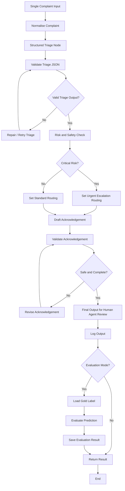
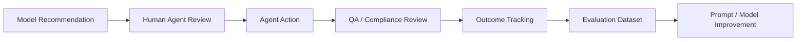

# FundSmart AI Complaint Triage Assistant — Pipeline Design Spec

## 1. Objective

Build a small end-to-end AI-assisted complaint triage and acknowledgement drafting prototype for the Bilue AI Engineer technical exercise.

The system should take a single customer complaint as input and produce two outputs:

1. A structured triage result.
2. A drafted acknowledgement message for a human frontline agent to review, lightly edit, and send.

This is not a full production system. The goal is to demonstrate:

- Engineering judgement
- A runnable harness
- Structured output design
- Synthetic test data usage
- Evaluation design
- At least one iteration from v1 to v2
- Clear human-in-the-loop workflow thinking

---

## 2. Key Design Decisions

### 2.1 Single-Turn Pipeline, Not Multi-Turn Chat

This prototype is a single-turn complaint processing pipeline.

Each complaint is treated as a case document. The system receives one complaint, analyses it, generates a structured triage recommendation, and drafts an acknowledgement.

Multi-turn conversation is out of scope for this prototype.

Multi-turn could be added later for:

- Asking customers for missing information
- Helping agents investigate a case
- Guiding complaint resolution workflows
- Customer-facing follow-up conversations

For this take-home test, do not implement chat memory.

---

### 2.2 No RAG in the Core Pipeline

Do not implement RAG for the core prototype.

The triage task should be completed from the complaint text itself. Each complaint should contain enough information for the system to classify category, severity, vulnerability signals, regulatory flags, routing, SLA recommendation, and acknowledgement requirements.

RAG may be useful in a future production version for:

- Approved complaint response templates
- Internal policies
- RG 271 guidance
- Complaint handling procedures
- Final resolution support

However, RAG is not required for this assignment and would add unnecessary complexity.

---

### 2.3 Human-in-the-Loop Design

The system must not autonomously resolve complaints or send responses.

The correct production-style framing is:

```text
Complaint received
→ AI triage recommendation
→ AI acknowledgement draft
→ Human agent review
→ Agent accepts / edits / rejects
→ Decision and outcome logged
```

The AI provides decision support. The human remains accountable.

---

### 2.4 Offline Evaluation Versus Production Mode

The system should support two modes:

```text
Production-style mode:
complaint → model output → human review → log result

Offline evaluation mode:
complaint → model output → compare against gold labels → compute metrics
```

Gold labels are only used for development and evaluation.

In real production, new complaints will not have gold labels at inference time. Instead, production feedback comes from:

- Agent corrections
- Agent overrides
- QA review
- Escalation outcomes
- SLA breaches
- AFCA escalation
- Customer re-contact
- Complaint resolution outcomes

---

## 3. High-Level Architecture



---

## 4. Recommended Project Structure

Generate the following project structure:

```text
fundsmart-triage-assistant/
│
├── README.md
├── pyproject.toml
├── .env.example
│
├── app.py
│
├── data/
│   ├── seed_complaints.jsonl
│   ├── synthetic_complaints.jsonl
│   ├── gold_labels.jsonl
│   └── synthetic_generation_notes.md
│
├── src/
│   ├── __init__.py
│   ├── config.py
│   ├── schemas.py
│   ├── prompts.py
│   ├── llm_client.py
│   ├── graph_state.py
│   ├── graph_nodes.py
│   ├── graph_builder.py
│   ├── evaluator.py
│   ├── io_utils.py
│   └── logging_utils.py
│
├── outputs/
│   ├── v1_outputs.jsonl
│   ├── v2_outputs.jsonl
│   ├── evaluation_v1.json
│   └── evaluation_v2.json
│
└── tests/
    ├── test_schemas.py
    ├── test_evaluator.py
    └── test_io_utils.py
```

---

## 5. CLI Interface

Use Typer for the command-line interface.

The CLI should support:

```bash
python app.py triage --file data/example_complaint.json
python app.py batch --input data/synthetic_complaints.jsonl --output outputs/v1_outputs.jsonl --version v1
python app.py batch --input data/synthetic_complaints.jsonl --output outputs/v2_outputs.jsonl --version v2
python app.py evaluate --predictions outputs/v1_outputs.jsonl --gold data/gold_labels.jsonl --output outputs/evaluation_v1.json
python app.py evaluate --predictions outputs/v2_outputs.jsonl --gold data/gold_labels.jsonl --output outputs/evaluation_v2.json
```

The CLI does not need web-style file upload. The user passes local file paths.

---

## 6. Input Format

Each complaint should be represented as JSON.

Example:

```json
{
  "id": "SYN-001",
  "channel": "in_app",
  "received": "2026-04-18 09:12 AEST",
  "customer_id": "CUST-60001",
  "subject": null,
  "message": "You charged me twice this month. Fix it and refund me."
}
```

For JSONL batch mode, each line should be one valid JSON object.

---

## 7. Output Format

Each model output should include:

```json
{
  "id": "SYN-001",
  "triage": {
    "category": "fees_charges",
    "severity": "medium",
    "vulnerability_signals": [],
    "regulatory_flags": [],
    "recommended_routing": "frontline_complaints",
    "sla_recommendation": "standard_acknowledgement",
    "customer_preferences": [],
    "complaint_summary": "The customer says they were charged twice this month and wants a refund.",
    "reasoning": "The complaint concerns a duplicate charge and refund request. There are no explicit hardship, vulnerability, responsible lending, fraud, self-harm, AFCA, or legal escalation signals."
  },
  "acknowledgement_draft": "Hi, thank you for contacting FundSmart. I’m sorry to hear you believe you were charged twice this month. We’ve received your complaint and will review the payment records. A complaints team member will follow up with the next steps.",
  "metadata": {
    "version": "v1",
    "triage_valid": true,
    "acknowledgement_valid": true,
    "retries": 0
  }
}
```

---

## 8. Allowed Taxonomy

### 8.1 Category Values

Use exactly these values:

```text
service_error
financial_hardship
responsible_lending
collections
fees_charges
fraud_or_identity
unclear_or_other
```

### 8.2 Severity Values

Use exactly these values:

```text
low
medium
high
critical
```

### 8.3 Routing Values

Use exactly these values:

```text
frontline_complaints
hardship_team
responsible_lending_specialist
collections_escalation
vulnerable_customer_team
legal_compliance_review
```

### 8.4 SLA Recommendation Values

Use exactly these values:

```text
standard_acknowledgement
same_day_acknowledgement
urgent_review
```

---

## 9. Severity Rules

Implement these rules in the prompt and optionally as deterministic post-processing checks.

### Low Severity

Use `low` when:

- The issue is routine.
- There is no clear financial harm.
- There are no hardship, vulnerability, fraud, responsible lending, collections, self-harm, AFCA, or legal escalation signals.

Examples:

- Routine app bug
- Statement request
- Minor service issue

### Medium Severity

Use `medium` when:

- There is financial impact, but no serious vulnerability or regulatory escalation.
- The customer disputes a fee, charge, payment mark, or service error.
- The customer is frustrated but not at obvious risk.

Examples:

- Duplicate charge
- Late fee dispute
- Missed payment due to staff error
- Credit file concern without hardship

### High Severity

Use `high` when:

- There are hardship indicators.
- The customer cannot afford repayments.
- The customer has vulnerability signals.
- There are collections concerns.
- The customer is at risk of arrears.
- There is a serious multi-issue complaint.

Examples:

- Job loss
- Reduced income
- Medical issue
- Family breakdown
- Collections pressure
- Payment arrangement not honoured

### Critical Severity

Use `critical` when:

- Self-harm or immediate safety risk is present.
- Fraud or identity theft is alleged.
- Responsible lending failure is alleged.
- AFCA, legal, or regulator escalation is threatened.
- Serious vulnerability appears together with arrears or collections pressure.

Examples:

- “I do not know if I can keep myself safe tonight.”
- “Someone opened a loan in my name.”
- “The financial counsellor says this loan should never have been approved.”
- “I am going to AFCA.”

---

## 10. LangGraph State Design

Implement a shared state object for the graph.

```python
from typing import Any, Dict, List, Optional, Literal, TypedDict


class ComplaintState(TypedDict, total=False):
    # Input
    complaint_id: str
    raw_complaint: Dict[str, Any]
    normalised_complaint: Dict[str, Any]

    # Triage
    triage_output: Dict[str, Any]
    triage_valid: bool
    triage_validation_errors: List[str]

    # Routing and risk
    critical_risk: bool
    routing_decision: str
    sla_recommendation: str

    # Acknowledgement
    acknowledgement_draft: str
    acknowledgement_valid: bool
    acknowledgement_validation_errors: List[str]

    # Evaluation
    evaluation_mode: bool
    gold_label: Optional[Dict[str, Any]]
    evaluation_result: Optional[Dict[str, Any]]

    # Versioning and observability
    version: Literal["v1", "v2"]
    errors: List[str]
    retries: int
```

---

## 11. LangGraph Nodes

Implement the following nodes.

### 11.1 `normalise_complaint`

Purpose:

- Convert raw complaint input into a consistent schema.
- Ensure required fields exist.
- Preserve original message text.

Input:

```python
state["raw_complaint"]
```

Output:

```python
state["normalised_complaint"]
```

---

### 11.2 `triage_complaint`

Purpose:

- Call the LLM.
- Produce structured triage JSON.
- Use prompt version `v1` or `v2`.

Input:

```python
state["normalised_complaint"]
state["version"]
```

Output:

```python
state["triage_output"]
```

---

### 11.3 `validate_triage`

Purpose:

- Validate triage output against Pydantic schema.
- Ensure category, severity, routing, and SLA values are allowed.
- Mark output valid or invalid.

Output:

```python
state["triage_valid"]
state["triage_validation_errors"]
```

---

### 11.4 `repair_triage`

Purpose:

- Retry or repair invalid JSON.
- Do not retry indefinitely.
- Use a maximum of 2 retries.

Output:

```python
state["triage_output"]
state["retries"]
```

---

### 11.5 `risk_safety_check`

Purpose:

- Determine whether the case is critical.
- This can be based on model output plus deterministic checks.

Critical signals include:

- Self-harm
- Fraud or identity theft
- Responsible lending allegation
- AFCA or legal escalation
- Serious vulnerability with arrears or collections pressure

Output:

```python
state["critical_risk"]
```

---

### 11.6 `set_urgent_escalation_routing`

Purpose:

- Set routing and SLA for critical cases.

Output examples:

```python
state["routing_decision"] = "vulnerable_customer_team"
state["sla_recommendation"] = "urgent_review"
```

or:

```python
state["routing_decision"] = "legal_compliance_review"
state["sla_recommendation"] = "urgent_review"
```

---

### 11.7 `set_standard_routing`

Purpose:

- Set standard routing based on triage category and severity.

Example mapping:

```python
{
    "service_error": "frontline_complaints",
    "fees_charges": "frontline_complaints",
    "financial_hardship": "hardship_team",
    "responsible_lending": "responsible_lending_specialist",
    "collections": "collections_escalation",
    "fraud_or_identity": "legal_compliance_review",
    "unclear_or_other": "frontline_complaints"
}
```

---

### 11.8 `draft_acknowledgement`

Purpose:

- Generate a customer-facing acknowledgement draft.
- The draft must be appropriate to category, severity, routing, vulnerability, and customer preferences.

The acknowledgement must:

- Confirm receipt of the complaint.
- Be empathetic.
- Avoid admitting liability.
- Explain next steps.
- Respect customer channel preferences where present.
- Escalate appropriately for hardship, vulnerability, fraud, responsible lending, or self-harm signals.
- Avoid over-promising outcomes.

Input:

```python
state["normalised_complaint"]
state["triage_output"]
state["routing_decision"]
state["sla_recommendation"]
state["critical_risk"]
```

Output:

```python
state["acknowledgement_draft"]
```

---

### 11.9 `validate_acknowledgement`

Purpose:

Check that the acknowledgement is:

- Empathetic
- Specific to the complaint
- Not admitting liability
- Not making unsupported promises
- Clear on next steps
- Safe for vulnerability or self-harm cases
- Appropriate to severity

Output:

```python
state["acknowledgement_valid"]
state["acknowledgement_validation_errors"]
```

---

### 11.10 `revise_acknowledgement`

Purpose:

- Revise the acknowledgement if it fails validation.
- Use maximum 2 retries.

Output:

```python
state["acknowledgement_draft"]
state["retries"]
```

---

### 11.11 `save_output`

Purpose:

- Save final output to JSONL.
- Include triage output, acknowledgement draft, metadata, and validation status.

---

### 11.12 `load_gold_label`

Purpose:

- Only used in offline evaluation mode.
- Load the gold label for the complaint ID.

---

### 11.13 `evaluate_output`

Purpose:

Compare prediction against gold label.

Compute:

- Category correctness
- Severity correctness
- Routing correctness
- Must-detect recall
- Must-not-detect violation count

---

### 11.14 `save_evaluation`

Purpose:

- Save per-case evaluation results.
- Later aggregate into final metrics.

---

## 12. Graph Routing Logic

Use conditional edges.

Pseudo-code:

```python
if triage_valid:
    go_to("risk_safety_check")
else:
    go_to("repair_triage")
```

```python
if critical_risk:
    go_to("set_urgent_escalation_routing")
else:
    go_to("set_standard_routing")
```

```python
if acknowledgement_valid:
    go_to("save_output")
else:
    go_to("revise_acknowledgement")
```

```python
if evaluation_mode:
    go_to("load_gold_label")
else:
    go_to("return_result")
```

---

## 13. Prompt Versions

Implement two prompt versions to show iteration.

### 13.1 v1 Prompt

The v1 prompt should be simple.

Purpose:

- Establish a baseline.
- Generate triage output and acknowledgement.

Expected weaknesses:

- May over-escalate emotional complaints.
- May miss subtle hardship.
- May produce generic acknowledgements.
- May confuse anger with vulnerability.
- May miss channel preferences.

---

### 13.2 v2 Prompt

The v2 prompt should improve on v1 by adding:

- Explicit severity rubric
- Explicit vulnerability extraction
- Explicit regulatory flag extraction
- Explicit instruction not to over-classify routine complaints
- Better acknowledgement constraints
- Stronger instruction to avoid inventing facts
- Safer handling of self-harm and critical cases

The v2 prompt should separate the reasoning process conceptually:

```text
1. Summarise the complaint.
2. Identify the customer impact.
3. Extract vulnerability signals.
4. Extract regulatory or escalation flags.
5. Assign category, severity, routing, and SLA.
6. Draft an acknowledgement.
```

The model should still return only valid JSON.

---

## 14. Pydantic Schemas

Implement Pydantic models in `src/schemas.py`.

Recommended models:

```python
from typing import List, Literal, Optional
from pydantic import BaseModel, Field


Category = Literal[
    "service_error",
    "financial_hardship",
    "responsible_lending",
    "collections",
    "fees_charges",
    "fraud_or_identity",
    "unclear_or_other",
]

Severity = Literal["low", "medium", "high", "critical"]

Routing = Literal[
    "frontline_complaints",
    "hardship_team",
    "responsible_lending_specialist",
    "collections_escalation",
    "vulnerable_customer_team",
    "legal_compliance_review",
]

SLARecommendation = Literal[
    "standard_acknowledgement",
    "same_day_acknowledgement",
    "urgent_review",
]


class ComplaintInput(BaseModel):
    id: str
    channel: str
    received: Optional[str] = None
    customer_id: Optional[str] = None
    subject: Optional[str] = None
    message: str


class TriageOutput(BaseModel):
    category: Category
    severity: Severity
    vulnerability_signals: List[str] = Field(default_factory=list)
    regulatory_flags: List[str] = Field(default_factory=list)
    recommended_routing: Routing
    sla_recommendation: SLARecommendation
    customer_preferences: List[str] = Field(default_factory=list)
    complaint_summary: str
    reasoning: str


class FinalOutput(BaseModel):
    id: str
    triage: TriageOutput
    acknowledgement_draft: str
    metadata: dict
```

---

## 15. Evaluation Design

Evaluation is offline only.

Input files:

```text
data/synthetic_complaints.jsonl
data/gold_labels.jsonl
outputs/v1_outputs.jsonl
outputs/v2_outputs.jsonl
```

Gold label example:

```json
{
  "id": "SYN-004",
  "expected_category": "financial_hardship",
  "expected_severity": "high",
  "expected_routing": "hardship_team",
  "must_detect": [
    "financial_hardship",
    "reduced_income",
    "late_fee",
    "cannot_afford_repayment"
  ],
  "must_not_detect": [
    "responsible_lending",
    "fraud"
  ]
}
```

---

## 16. Required Metrics

Implement these metrics:

```text
category_accuracy
severity_accuracy
routing_accuracy
must_detect_recall
must_not_detect_violation_rate
critical_case_recall
```

### 16.1 Category Accuracy

```text
number of cases where predicted category == expected category
/
total number of cases
```

### 16.2 Severity Accuracy

```text
number of cases where predicted severity == expected severity
/
total number of cases
```

### 16.3 Routing Accuracy

```text
number of cases where predicted routing == expected routing
/
total number of cases
```

### 16.4 Must-Detect Recall

For each case:

```text
number of required signals detected
/
number of required signals
```

Aggregate by averaging across cases.

### 16.5 Must-Not-Detect Violation Rate

For each case, check whether the model incorrectly added signals that should not appear.

```text
number of cases with at least one forbidden signal
/
total number of cases
```

### 16.6 Critical Case Recall

For gold cases where expected severity is `critical`, check whether predicted severity is also `critical`.

```text
critical cases correctly identified
/
total critical cases
```

---

## 17. Production Feedback Loop

In production, do not use gold labels at inference time.

Instead, log:

```text
model category
model severity
model routing
model regulatory flags
model vulnerability signals
model acknowledgement draft
agent final category
agent final severity
agent final routing
agent edits
agent accepted / edited / rejected draft
case escalation
SLA outcome
AFCA escalation
QA audit result
```

This creates future labelled evaluation data.

Production feedback loop:



---

## 18. Logging and Observability

For each run, log:

```text
complaint_id
version
timestamp
category
severity
routing
sla_recommendation
critical_risk
triage_valid
acknowledgement_valid
retry_count
error_messages
latency_ms
```

Do not build production-grade observability. Simple JSON logging is sufficient.

---

## 19. README Requirements

The generated README should explain:

1. What the system does.
2. How to install dependencies.
3. How to run single complaint triage.
4. How to run batch triage.
5. How to run evaluation.
6. What v1 and v2 mean.
7. Why RAG was not used.
8. Why multi-turn chat was not used.
9. How gold labels are used only for offline evaluation.
10. What would be added in production.

---

## 20. Example README Framing

Use this wording:

```text
This prototype is implemented as a single-turn, human-in-the-loop complaint processing pipeline. It is not a multi-turn chatbot and does not use RAG in the core workflow. Each complaint is treated as a case document. The system produces a structured triage recommendation and an acknowledgement draft for human review.

Gold labels are used only for offline evaluation in this prototype. In a real production workflow, new complaints would not have labels at inference time. Instead, agent corrections, QA reviews, escalation outcomes, SLA performance, and complaint resolution outcomes would be logged and periodically converted into labelled evaluation data.
```

---

## 21. What Not to Build

Do not build:

- Streamlit UI
- FastAPI service
- Vector database
- RAG pipeline
- Multi-turn memory
- CRM integration
- Full regulatory knowledge base
- Production deployment
- Authentication
- Database persistence

These are out of scope for the take-home exercise.

---


---

## 23. Versioning Strategy: v1 Versus v2

The prototype must support two pipeline versions:

```text
v1 = baseline version
v2 = improved final version after evaluation
```

The purpose of supporting both versions is to demonstrate iteration, not to expose multiple product modes to end users.

### 23.1 What v1 Means

`v1` is the first working baseline version of the system.

It should use the same overall pipeline structure, but with a simpler prompt and fewer explicit rules.

Typical v1 characteristics:

- Basic structured triage prompt
- Basic acknowledgement drafting prompt
- Minimal explicit severity rubric
- Minimal vulnerability extraction guidance
- Minimal regulatory flag guidance
- No strong instruction to separate anger from vulnerability
- No strong instruction to avoid over-escalating routine complaints

Expected v1 weaknesses:

- May over-escalate angry complaints.
- May miss subtle hardship.
- May miss customer contact preferences.
- May confuse emotional tone with actual vulnerability.
- May produce generic acknowledgement drafts.
- May miss responsible lending, AFCA, fraud, or safety-critical flags.
- May classify routine app or service issues as more serious than they are.

The purpose of v1 is to create a measurable baseline.

---

### 23.2 What v2 Means

`v2` is the final improved version of the prototype.

It should keep the same pipeline shape but improve the prompt, validation, and risk rules based on v1 evaluation findings.

Typical v2 improvements:

- Explicit severity rubric
- Explicit category definitions
- Explicit vulnerability signal extraction
- Explicit regulatory and escalation flag extraction
- Stronger instruction to avoid inventing facts
- Stronger instruction not to over-escalate routine complaints
- Better distinction between anger and vulnerability
- Better handling of hidden hardship
- Better handling of critical cases, including:
  - Self-harm
  - Fraud or identity theft
  - Responsible lending allegation
  - AFCA or legal escalation
  - Serious vulnerability with arrears or collections pressure
- Better acknowledgement constraints:
  - Empathetic
  - Specific to the complaint
  - Does not admit liability
  - Does not over-promise
  - Explains next steps
  - Respects customer channel preferences

The purpose of v2 is to show how evaluation findings improved the system.

---

### 23.3 Difference Between v1 and v2

| Area | v1 | v2 |
|---|---|---|
| Role | Baseline | Final improved version |
| Prompt | Simple triage and drafting prompt | Detailed triage prompt with rubric |
| Severity | Model decides broadly | Uses explicit low / medium / high / critical rules |
| Category | Basic category selection | Category definitions are explicit |
| Vulnerability | General instruction only | Explicit extraction of hardship, distress, medical, family, income, safety signals |
| Regulatory flags | May be missed | Explicit check for AFCA, responsible lending, fraud, legal escalation, collections risk |
| Acknowledgement | More generic | Tailored to severity, routing, vulnerability, and customer preference |
| Safety | Basic | Critical-risk handling and safety checks |
| Purpose | Create baseline metrics | Demonstrate improvement |

---

### 23.4 Submission Rule

Submit `v2` as the final runnable system, but include `v1` evidence to demonstrate iteration.

Required submission artefacts should include:

```text
outputs/v1_outputs.jsonl
outputs/v2_outputs.jsonl
outputs/evaluation_v1.json
outputs/evaluation_v2.json
```

The README should explain:

```text
The submitted pipeline defaults to v2, which is the improved version after evaluation. v1 is preserved for reproducibility and comparison. v1 was the baseline, evaluation surfaced failure modes, and v2 introduced a clearer severity rubric, vulnerability extraction, regulatory flag checks, and improved acknowledgement constraints.
```

---

### 23.5 CLI Version Flag

The CLI must support a version flag:

```bash
python app.py triage --file data/example_complaint.json --version v1
python app.py triage --file data/example_complaint.json --version v2
```

For batch evaluation:

```bash
python app.py batch --input data/synthetic_complaints.jsonl --output outputs/v1_outputs.jsonl --version v1
python app.py batch --input data/synthetic_complaints.jsonl --output outputs/v2_outputs.jsonl --version v2
```

The CLI should default to `v2`.

Example Typer option:

```python
import typer
from typing import Literal

Version = Literal["v1", "v2"]

def triage(
    file: str = typer.Option(..., "--file", "-f"),
    version: Version = typer.Option(
        "v2",
        "--version",
        help="Pipeline version to run: v1 or v2. Defaults to v2."
    ),
):
    ...
```

When the user runs:

```bash
python app.py triage --file data/example_complaint.json
```

the system should automatically run `v2`.

---

### 23.6 Product Interpretation

In this take-home prototype, supporting `--version v1` and `--version v2` is useful for reproducibility and evaluation.

However, this should not be described as an end-user product toggle.

Use this wording in the README:

```text
The runnable harness supports both v1 and v2 via a CLI version flag. v1 is preserved for reproducibility and comparison, while v2 is the default final pipeline. In a real production environment, this would be controlled by deployment configuration, experiment tracking, or feature flags, not by an end-user toggle.
```

In a real production system:

- End users would normally see only the approved production version.
- Version selection would be controlled by deployment configuration.
- A/B tests or shadow evaluations could be managed by feature flags.
- Historical versions would be kept for audit, rollback, and evaluation reproducibility.

---

### 23.7 Suggested Implementation Detail

Implement prompt version selection in `src/prompts.py`:

```python
V1_TRIAGE_PROMPT = """...basic baseline prompt..."""

V2_TRIAGE_PROMPT = """...improved prompt with severity rubric, vulnerability extraction, regulatory flags, and acknowledgement constraints..."""


def get_triage_prompt(version: str) -> str:
    if version == "v1":
        return V1_TRIAGE_PROMPT
    if version == "v2":
        return V2_TRIAGE_PROMPT
    raise ValueError(f"Unknown prompt version: {version}")
```

The LangGraph state should carry the selected version:

```python
state["version"] = version
```

The `triage_complaint` node should read:

```python
prompt = get_triage_prompt(state["version"])
```

This keeps the graph structure stable while allowing prompt behaviour to change between v1 and v2.

---

### 23.8 Presentation Framing

Use this explanation in the presentation:

```text
I am presenting v2 as the final version, but I kept v1 because the exercise asks for evidence of iteration. The purpose of v1 was to create a measurable baseline. The purpose of v2 was to show how evaluation findings changed the design.

v1 produced structured outputs, but evaluation showed that it sometimes over-escalated emotional complaints and missed subtle hardship signals. v2 kept the same pipeline but improved the prompt and validation logic by adding an explicit severity rubric, vulnerability extraction, regulatory flag checks, and stronger acknowledgement constraints.
```


## 22. Codex Implementation Task

Use this specification to generate a complete but lightweight Python project.

Requirements:

1. Use Typer for the CLI.
2. Use Pydantic for schemas.
3. Use LangGraph-style workflow orchestration.
4. Use an LLM client abstraction so the model provider can be swapped.
5. Support prompt versions `v1` and `v2`.
6. Default to `v2` as the final submitted pipeline.
7. Preserve `v1` for reproducibility and evaluation comparison.
8. Expose version selection through a CLI `--version` flag, not an end-user product toggle.
9. Support single complaint mode.
10. Support batch JSONL mode.
11. Support offline evaluation mode.
12. Save outputs as JSONL.
13. Save evaluation summaries as JSON.
14. Include simple tests for schema validation, version selection, and evaluator logic.
15. Keep implementation simple and readable.

Do not over-engineer the solution.

The priority is a clear, runnable harness that demonstrates structured triage, acknowledgement drafting, evaluation, and iteration.
